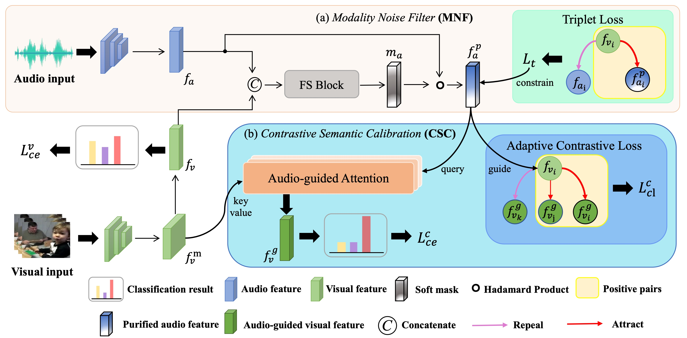

# Robust Cross-Modal Distillation for Unconstrained Videos
PyTorch implementation of [Robust Cross-Modal Distillation for Unconstrained Videos]()

## Introduction

Cross-modal distillation has been widely used to transfer knowledge across different modalities, enriching the representation of the target unimodal one. Recent studies highly relate the temporal synchronization between vision and sound to the semantic consistency for cross-modal distillation. However, such semantic consistency from the synchronization is hard to guarantee in unconstrained videos, due to the __irrelevant modality noise and differentiated semantic correlation__.

 To mitigate these issues, we first propose a __Modality Noise Filter__(MNF) module to erase the irrelevant noise in teacher modality with cross-modal context. After this purification, we then design a __Contrastive Semantic Calibration__ (CSC) module to adaptively distill useful knowledge for target modality, by referring to the differentiated sample-wise semantic correlation in a contrastive fashion. 
 
Extensive experiments show that our method could bring a performance boost compared with other distillation methods in both visual action recognition and video retrieval task. We also extend to the audio tagging task to prove the generalization of our method.



## Install

```
git clone git@github.com:GeWu-Lab/cross-modal-knowledge-distillation-for-unconstrained-videos.git
cd cross-modal-knowledge-distillation-for-unconstrained-videos
pip install -r requirements.txt
```

## Traing & Validation
Use the following commands to test on UCF51 dataset. The checkpoints of our model are in `results` dir.

+ train on UCF51
```
    sh scripts/ucf_train_script.sh
```

+ validation on UCF51
```
    sh scripts/ucf_test_script.sh
```

+ get retrieval result on UCF51
```
    sh retrieval/ucf_retrieval.sh
    python retrieval/mAP_result_ucf.py
    python retrieval/get_retrieval_result_ucf.py
```
## Checkpoints

The dataset and checkpoints could download from [here](https://1drv.ms/f/s!AooeTdoS6OospBjZIuhIDCsJzReN?e=U0qynK)


## Bibtex
```
    
```


